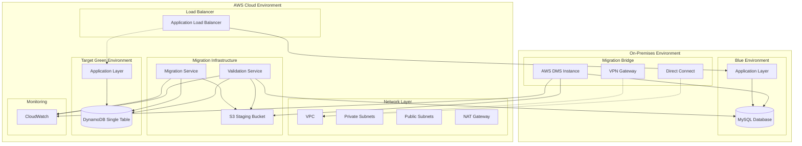
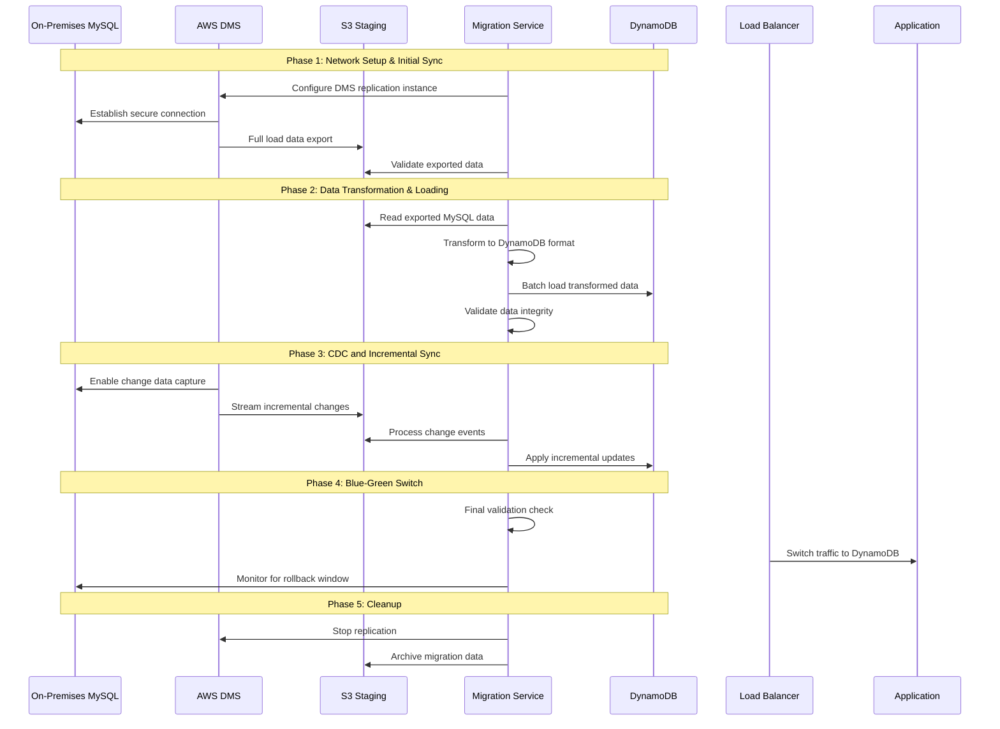
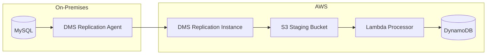
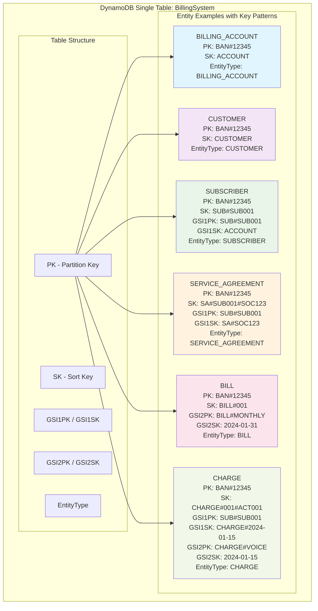
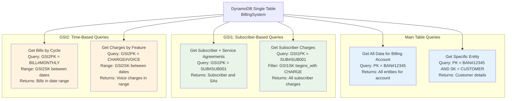
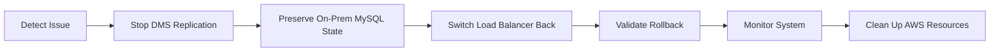

# Design Document

## Overview

This design outlines the migration from MySQL to DynamoDB using a single table design pattern with blue-green deployment strategy. The solution maintains zero downtime while transforming a relational billing system into a NoSQL structure optimized for DynamoDB's strengths.

## Architecture

### Migration Architecture



### On-Premises to AWS Migration Flow



## On-Premises to AWS Connectivity

### Network Architecture Options

#### Option 1: VPN Connection
- **Use Case**: Lower data volumes, cost-sensitive migrations
- **Bandwidth**: Up to 1.25 Gbps per tunnel
- **Latency**: Variable, internet-dependent
- **Security**: IPSec encryption
- **Cost**: Lower setup and operational costs

#### Option 2: AWS Direct Connect
- **Use Case**: High data volumes, consistent performance requirements
- **Bandwidth**: 1 Gbps to 100 Gbps dedicated
- **Latency**: Consistent, predictable
- **Security**: Private connection, optional encryption
- **Cost**: Higher setup cost, predictable data transfer costs

#### Hybrid Approach
- Primary: Direct Connect for bulk data transfer
- Backup: VPN for redundancy and smaller incremental updates

### Data Transfer Strategy

#### AWS Database Migration Service (DMS) Integration


#### Data Transfer Phases

1. **Full Load Phase**
   - DMS performs complete data export from on-premises MySQL
   - Data staged in S3 with compression and encryption
   - Parallel processing for large tables
   - Checksum validation for data integrity

2. **Change Data Capture (CDC) Phase**
   - Real-time capture of changes from MySQL binary logs
   - Incremental updates streamed to S3
   - Event-driven processing with Lambda triggers
   - Minimal impact on source database performance

3. **Cutover Phase**
   - Final sync of remaining changes
   - Application traffic switch with minimal downtime
   - Rollback capability maintained

### Security Considerations

#### Data in Transit
- TLS 1.2+ encryption for all connections
- VPN IPSec tunneling for internet-based connections
- Direct Connect with MACsec encryption option
- Certificate-based authentication

#### Data at Rest
- S3 server-side encryption (SSE-S3 or SSE-KMS)
- DynamoDB encryption at rest
- Encrypted EBS volumes for migration instances

#### Access Control
- IAM roles with least privilege principles
- VPC security groups restricting network access
- Database user accounts with minimal required permissions
- CloudTrail logging for all API calls

## Components and Interfaces

### DynamoDB Single Table Design

#### Table Structure
- **Table Name**: `BillingSystem`
- **Partition Key**: `PK` (String)
- **Sort Key**: `SK` (String)
- **Global Secondary Indexes**:
  - GSI1: `GSI1PK` / `GSI1SK` - For subscriber-based queries
  - GSI2: `GSI2PK` / `GSI2SK` - For time-based queries (bills, charges)

#### Entity Mapping

| Entity | PK Pattern | SK Pattern | GSI1PK | GSI1SK | GSI2PK | GSI2SK |
|--------|------------|------------|---------|---------|---------|---------|
| BILLING_ACCOUNT | `BAN#{BAN}` | `ACCOUNT` | - | - | - | - |
| CUSTOMER | `BAN#{BAN}` | `CUSTOMER` | - | - | - | - |
| SUBSCRIBER | `BAN#{BAN}` | `SUB#{subscriber_no}` | `SUB#{subscriber_no}` | `ACCOUNT` | - | - |
| SERVICE_AGREEMENT | `BAN#{BAN}` | `SA#{subscriber_no}#{SOC}` | `SUB#{subscriber_no}` | `SA#{SOC}` | - | - |
| BILL | `BAN#{BAN}` | `BILL#{bill_seq_number}` | - | - | `BILL#{cycle_code}` | `{cycle_close_date}` |
| CHARGE | `BAN#{BAN}` | `CHARGE#{charge_seq}#{activity_num}` | `SUB#{subscriber_no}` | `CHARGE#{charge_creation_date}` | `CHARGE#{feature_code}` | `{charge_creation_date}` |

#### DynamoDB Single Table Design Visualization



#### Access Patterns with Key Structures



#### Key Design Patterns

1. **Get Billing Account with all related data**
   - Query: `PK = BAN#{BAN}` 
   - Returns: Account, Customer, Subscribers, Bills, Charges

2. **Get Subscriber with Service Agreements**
   - Query GSI1: `GSI1PK = SUB#{subscriber_no}`
   - Returns: Subscriber and all Service Agreements

3. **Get Bills by Cycle**
   - Query GSI2: `GSI2PK = BILL#{cycle_code}` with date range on `GSI2SK`

4. **Get Charges by Feature Code and Date Range**
   - Query GSI2: `GSI2PK = CHARGE#{feature_code}` with date range on `GSI2SK`

### Migration Service Components

#### S3 Data Processing Layer
```typescript
interface S3DataProcessor {
  processFullLoadFiles(s3Prefix: string): Promise<ProcessingResult>
  processCDCEvents(s3Key: string): Promise<CDCResult>
  validateS3Data(s3Key: string): Promise<ValidationResult>
  archiveProcessedData(s3Key: string): Promise<void>
}

interface DMSEventProcessor {
  parseFullLoadRecord(record: S3Record): Promise<MySQLEntity>
  parseCDCRecord(record: S3Record): Promise<CDCEvent>
  handleInsertEvent(event: CDCEvent): Promise<void>
  handleUpdateEvent(event: CDCEvent): Promise<void>
  handleDeleteEvent(event: CDCEvent): Promise<void>
}
```

#### Data Extraction Layer (Legacy - for validation)
```typescript
interface DataExtractor {
  extractBillingAccounts(): Promise<BillingAccount[]>
  extractSubscribers(ban: string): Promise<Subscriber[]>
  extractCharges(ban: string, dateRange?: DateRange): Promise<Charge[]>
  extractBills(ban: string): Promise<Bill[]>
  extractCustomers(ban: string): Promise<Customer[]>
  extractServiceAgreements(ban: string): Promise<ServiceAgreement[]>
}
```

#### Data Transformation Layer
```typescript
interface DataTransformer {
  transformToDynamoDBItem(entity: MySQLEntity): DynamoDBItem
  generatePartitionKey(entity: MySQLEntity): string
  generateSortKey(entity: MySQLEntity): string
  generateGSIKeys(entity: MySQLEntity): GSIKeys
}
```

#### Data Loading Layer
```typescript
interface DataLoader {
  batchWriteItems(items: DynamoDBItem[]): Promise<BatchWriteResult>
  validateWrite(item: DynamoDBItem): Promise<boolean>
  handleWriteErrors(errors: WriteError[]): Promise<void>
}
```

## Data Models

### DynamoDB Item Structure

```typescript
interface DynamoDBItem {
  PK: string           // Partition Key
  SK: string           // Sort Key
  GSI1PK?: string      // GSI1 Partition Key
  GSI1SK?: string      // GSI1 Sort Key
  GSI2PK?: string      // GSI2 Partition Key
  GSI2SK?: string      // GSI2 Sort Key
  EntityType: string   // ACCOUNT, CUSTOMER, SUBSCRIBER, etc.
  CreatedAt: string    // ISO timestamp
  UpdatedAt: string    // ISO timestamp
  TTL?: number         // For temporary migration tracking items
  [key: string]: any   // Entity-specific attributes
}
```

### Migration Tracking

```typescript
interface MigrationStatus {
  PK: string           // "MIGRATION#STATUS"
  SK: string           // "BATCH#{batch_id}"
  BatchId: string
  EntityType: string
  Status: 'PENDING' | 'IN_PROGRESS' | 'COMPLETED' | 'FAILED'
  RecordsProcessed: number
  RecordsFailed: number
  StartTime: string
  EndTime?: string
  ErrorDetails?: string[]
  TTL: number          // Auto-cleanup after migration
}
```

## Error Handling

### Migration Error Strategies

1. **Batch Processing Errors**
   - Implement exponential backoff for throttling
   - Dead letter queue for failed items
   - Detailed logging with correlation IDs

2. **Data Validation Errors**
   - Pre-migration validation checks
   - Post-migration data integrity verification
   - Rollback procedures for critical failures

3. **Application Layer Errors**
   - Circuit breaker pattern for DynamoDB calls
   - Graceful degradation during migration
   - Health check endpoints for monitoring

### Network Resilience and Failover

#### Connection Monitoring
```typescript
interface NetworkMonitor {
  checkVPNHealth(): Promise<ConnectionStatus>
  checkDirectConnectHealth(): Promise<ConnectionStatus>
  monitorBandwidthUtilization(): Promise<BandwidthMetrics>
  detectNetworkPartition(): Promise<boolean>
}

interface FailoverManager {
  switchToBackupConnection(): Promise<void>
  pauseMigrationOnNetworkIssue(): Promise<void>
  resumeMigrationAfterRecovery(): Promise<void>
  validateDataIntegrityAfterFailover(): Promise<ValidationResult>
}
```

#### Data Consistency During Network Issues
- **Checkpoint Management**: Regular checkpoints stored in S3
- **Resume Capability**: Ability to resume from last successful checkpoint
- **Duplicate Detection**: Handling of duplicate records during network recovery
- **Ordering Guarantees**: Maintaining CDC event ordering across network interruptions

### Rollback Strategy



## Testing Strategy

### Migration Testing Phases

1. **Unit Testing**
   - Data transformation logic
   - Key generation algorithms
   - Validation functions

2. **Integration Testing**
   - End-to-end migration pipeline
   - DynamoDB read/write operations
   - Application layer compatibility

3. **Performance Testing**
   - Migration throughput benchmarks
   - DynamoDB query performance
   - Load testing during blue-green switch

4. **Data Validation Testing**
   - Record count verification
   - Data integrity checks
   - Relationship preservation validation

### Monitoring and Alerting

#### Key Metrics
- Migration progress (records/minute)
- Error rates by entity type
- DynamoDB consumed capacity
- Application response times
- Data consistency checks

#### Alert Conditions
- Migration failure rate > 1%
- DynamoDB throttling events
- Data validation failures
- Application error rate increase
- Blue-green switch failures

### Performance Optimization for On-Premises Migration

#### Bandwidth Management
- **Compression**: Enable compression for DMS data transfer
- **Parallel Processing**: Multiple DMS tasks for large tables
- **Throttling**: Rate limiting to avoid overwhelming on-premises network
- **Off-Peak Scheduling**: Schedule bulk transfers during low-usage periods

#### Data Transfer Optimization
```typescript
interface TransferOptimizer {
  calculateOptimalBatchSize(networkBandwidth: number): number
  scheduleTransferWindows(businessHours: TimeWindow[]): Schedule
  monitorTransferRates(): Promise<TransferMetrics>
  adjustTransferParameters(metrics: TransferMetrics): Promise<void>
}
```

### Deployment Checklist

1. **Pre-Migration**
   - [ ] Network connectivity established (VPN/Direct Connect)
   - [ ] DMS replication instance configured and tested
   - [ ] S3 staging bucket created with proper permissions
   - [ ] DynamoDB table created with proper capacity
   - [ ] Security groups and IAM roles configured
   - [ ] Migration scripts tested in staging environment
   - [ ] Monitoring dashboards configured
   - [ ] Rollback procedures documented and tested

2. **During Migration**
   - [ ] Network connectivity monitoring active
   - [ ] DMS replication monitoring active
   - [ ] Real-time data validation running
   - [ ] Performance metrics tracked (bandwidth, latency, throughput)
   - [ ] Error handling and retry mechanisms verified
   - [ ] CDC lag monitoring for incremental sync

3. **Post-Migration**
   - [ ] Data integrity validated between on-premises and DynamoDB
   - [ ] Performance benchmarks met
   - [ ] Application functionality verified
   - [ ] Network connections maintained for rollback window
   - [ ] On-premises MySQL preserved for rollback period
   - [ ] Migration infrastructure cleanup scheduled